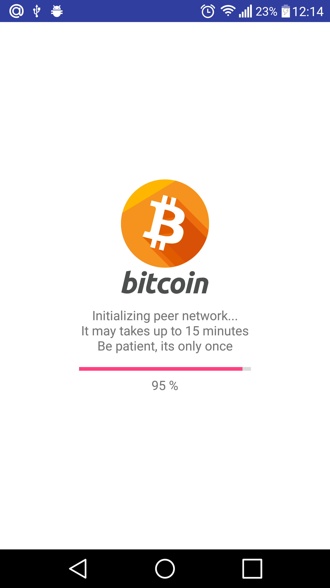
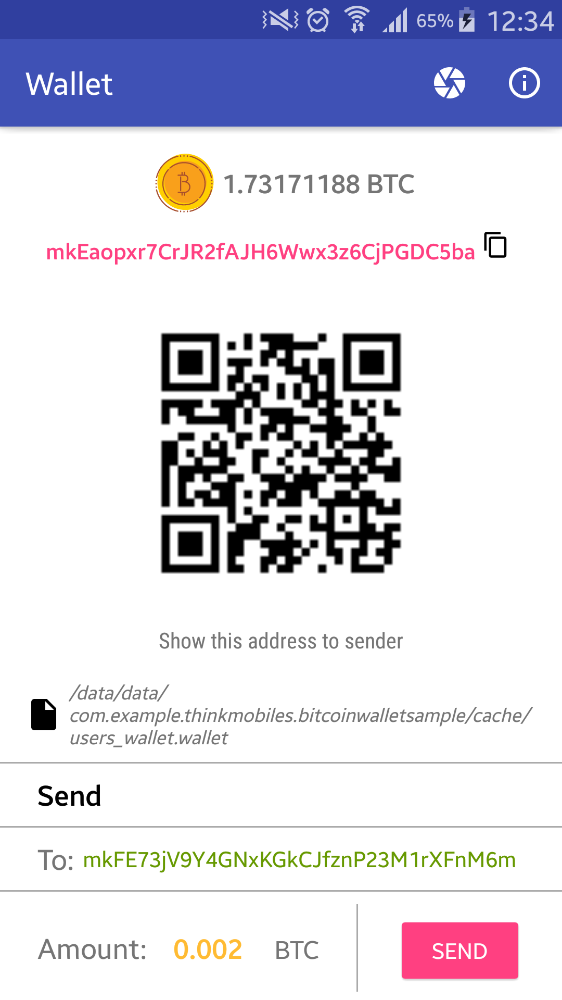
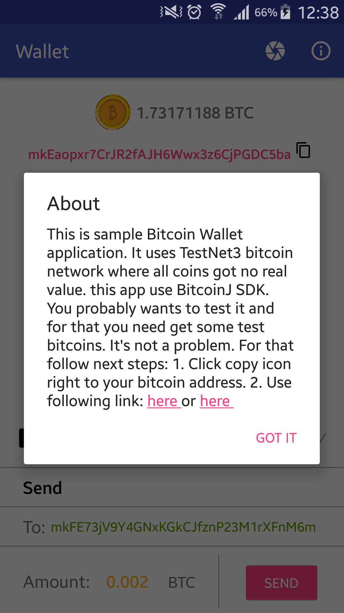
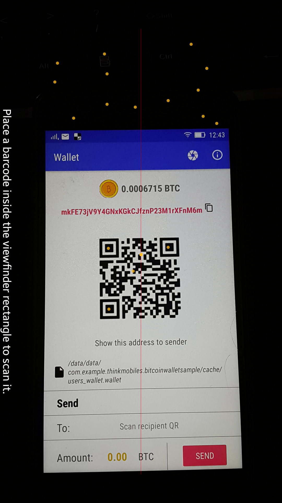

## BitcoinJ Wallet Sample

Sample application of using the <a href="https://bitcoinj.github.io/">BitcoinJ SDK</a> (MVP architecture).

<b>When you launch application first time it needs to download peer network, it may takes up to 15 minutes, but it happens only once, so be patiant and drink some tea or coffee meanwhile.</b>

# Functionality

Application works with official bitcoin test network (TestNet3) and contains next features: 
* Create wallet
* Get balance
* Receive transactions
* Send transactions
* Get free test bitcoins
* Generating your wallet address QR code
* Scan recipient wallet address QR code

# Screenshots
&nbsp;
&nbsp;



# Service Information
SDK tutorial https://bitcoinj.github.io/getting-started-java

In `build.gradle`:
```
    dependencies {
        compile 'org.bitcoinj:bitcoinj-core:0.14.4'
        
        //Logging
        compile 'org.slf4j:slf4j-api:1.7.12'
        compile 'org.slf4j:slf4j-simple:1.7.12'
    }
```
Example uses next additinal libraries:
* <a href="https://github.com/androidannotations/androidannotations">Android Annotations</a>
* <a href="https://github.com/kenglxn/QRGen">QRGen</a>
* <a href="https://github.com/zxing/zxing">ZXing</a>

# Developers

* [Saldan Roman](https://github.com/RomanSaldan)
